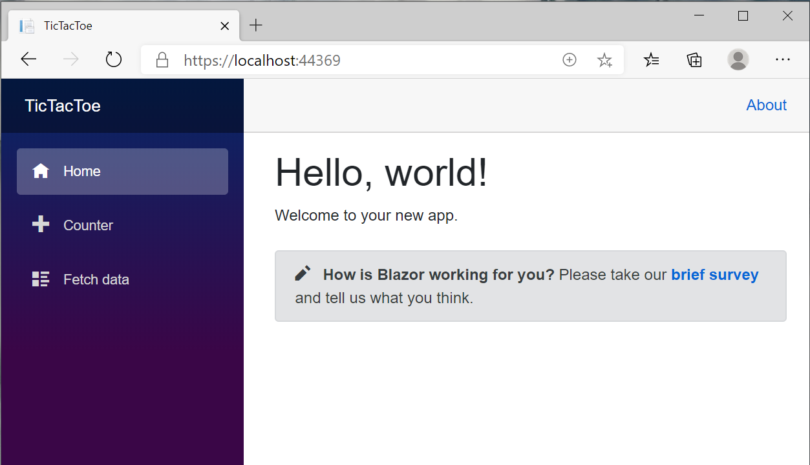
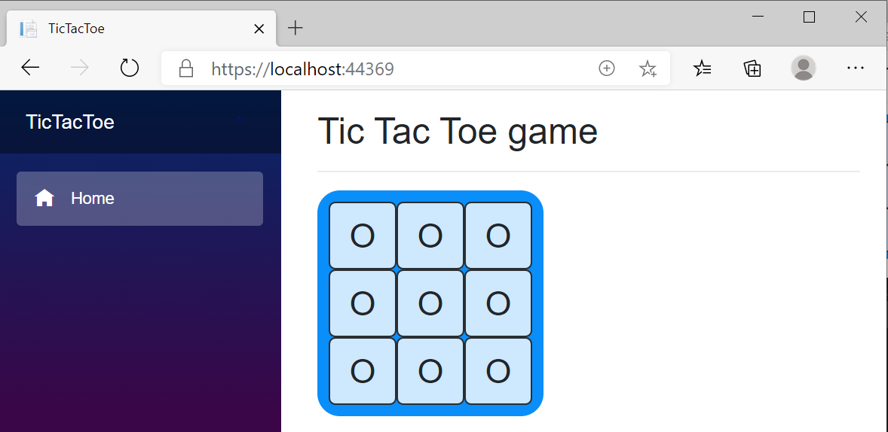

Blazor WebAssembly has officially made it to its first production release in the Microsoft Build 2020. In this post, we are going to learn some features of this amazing technology step by step building a [Tic Tac Toe](https://playtictactoe.org/) game.

This is the final version of our game: [Tic-Tac-Toe](https://ysflghou.github.io/BlazorTicTacToe/), let's build it step by step.

# What is Blazor WebAssembly?

Blazor is an open source and cross-platform web UI framework for building single-page apps using .NET and C# instead of JavaScript. Blazor is based on a powerful and flexible component model (like components in modern javascript frameworks) for building rich interactive web UI. You implement Blazor UI components using a combination of .NET code and Razor syntax: an elegant melding of HTML and C#. Blazor components can seamlessly handle UI events, bind to user input, and efficiently render UI updates.

Blazor components can then be hosted in different ways to create your web app. The first supported way is called Blazor Server. In a Blazor Server app, the components run on the server using .NET Core. All UI interactions and updates are handled using a real-time WebSocket connection with the browser.

Blazor WebAssembly is now the second supported way to host your Blazor components: client-side in the browser using a WebAssembly-based .NET runtime. Blazor WebAssembly includes a proper .NET runtime implemented in WebAssembly, a standardized bytecode for the web. This .NET runtime is downloaded with your Blazor WebAssembly app and enables running normal .NET code directly in the browser. No plugins or code transpilation are required. Blazor WebAssembly works with all modern web browsers, both desktop and mobile. Similar to JavaScript, Blazor WebAssembly apps run securely on the user’s device from within the browser’s security sandbox. These apps can be deployed as completely standalone static sites without any .NET server component at all, or they can be paired with ASP.NET Core to enable full stack web development with .NET, where code can be effortlessly shared with the client and server.

# Get started

Getting started with Blazor WebAssembly is easy: simply go to https://blazor.net and install the latest .NET Core SDK, which includes everything you need to build and run Blazor WebAssembly apps.

You can then create and run your first Blazor WebAssembly app by running:

```js
dotnet new blazorwasm -o TicTacToe
cd TicTacToe
dotnet run
```

Browse to `https://localhost:portNumber`, and congratulations! You’ve just built and run your first Blazor WebAssembly app! you can find your port number in the `TicTacToe/Properties/lanchSetting.json` file, it's often 5000/5001 unless you are using IIS.



To maximize your Blazor productivity, be sure to install a supported version of Visual Studio for your platform of choice, or use our dear friend Visual Studio Code with C# extension.

📝 There is a [guide](https://docs.microsoft.com/en-us/aspnet/core/blazor/get-started?view=aspnetcore-3.1&tabs=visual-studio) explaining the starter project if you are interested.

# Clean up the starter project

To start our coding journey we will clean the starter project first:

- Add a gitignore file. If you find trouble creating a .gitignore file for the starter template you can use this command:

```js
dotnet new gitignore
```

in the root folder of your project.

- Remove unused components; `TicTacToe/Pages/Counter.razor`, `TicTacToe/Pages/FetchData.razor`, `TicTacToe/Shared/SurveyPrompt.razor` and their usage.
- Version your project with git:

```git
git init
git add .
git commit -m "initial commit"
```

# Create components

All we need for now is to create a board with 9 squares. So, we create a `Square` component and a `Board` component.
The Square component will look like this

```tsx
// Components/Square.razor

<div class="square">O</div>

<style scoped>
    .square {
        background-color: rgba(255, 255, 255, 0.8);
        border: 1px solid rgba(0, 0, 0, 0.8);
        width: 60px;
        height: 60px;
        font-size: 30px;
        text-align: center;
        vertical-align: middle;
        line-height: 60px;
        border-radius: 10%;
        cursor: pointer;
    }
    .square:hover {
        background-color: rgba(106, 202, 9, 0.8);
    }
</style>
```

And the Board component:

```tsx
// Components/Board.razor

<div class="board">
    <Square />
    <Square />
    <Square />
    <Square />
    <Square />
    <Square />
    <Square />
    <Square />
    <Square />
</div>

<style scoped>
    .board {
        display: grid;
        grid-template-columns: auto auto auto;
        background-color: #0a8efa;
        padding: 10px;
        width: 200px;
        height: 200px;
        border-radius: 10%;
    }
</style>
```

Finally, let's modify our index page to hold the board:

```tsx {6-8}
// Pages/Index.razor

@page "/"
@using TicTacToe.Components

<h2>Tic Tac Toe game</h2>
<hr />
<Board />
```

Our application looks good for now!



# The javascript way: State, Props and events handling

Let's add a custom `value` to our squares and a click handler method, all in C# code.

```tsx {3-10}
// Components/Square.razor

<div class="square" @onclick="ChangeValue">@value</div>
@code {
    private char value = ' ';
    private void ChangeValue()
    {
        value = value == 'O' ? 'X' : 'O';
    }
}
<style scoped>
    .square {
        background-color: rgba(255, 255, 255, 0.8);
        border: 1px solid rgba(0, 0, 0, 0.8);
        width: 60px;
        height: 60px;
        font-size: 30px;
        text-align: center;
        vertical-align: middle;
        line-height: 60px;
        border-radius: 10%;
        cursor: pointer;
    }
    .square:hover {
        background-color: rgba(106, 202, 9, 0.8);
    }
</style>
```

These values compose the **State** of the squares, we define them in the code section of a component and we can manipulate them by the other component methods or render them in the UI.

And here is the result of this tiny changes we have made:


Now, since we have to determine how the game ends and what is its state in a given time, it's better to let the Board component control the game. So we will manage our state (the squares values) in the Board component.

We will pass the values and the click handler from the Board (the parent component) to the Squares (the child components).

The Square component define some parameters that we can set their values whenever we use them, these are the **Props** in blazor.

```tsx {3-10}
// Components/Square.razor

<div class="square" @onclick="@ClickHandler">@value</div>

@functions {
    [Parameter]
    public char value { get; set; }
    [Parameter]
    public EventCallback ClickHandler { get; set; }
}

<style scoped>
.square {
  background-color: rgba(255, 255, 255, 0.8);
  border: 1px solid rgba(0, 0, 0, 0.8);
  width: 60px;
  height: 60px;
  font-size: 30px;
  text-align: center;
  vertical-align: middle;
  line-height: 60px;
  border-radius: 10%;
  cursor: pointer;
}

.square:hover {
  background-color: rgba(106, 202, 9, 0.8);
}
</style>
```

The value of the `ClickHandler` and `value` will be set from the Board component where the Squares are used

```tsx {3-28}
// Components/Board.razor

<div class="board">
    @for (int i = 0; i < 9; i++)
    {
        int squareNumber = i;
        <Square @key=squareNumber
                value=values[squareNumber]
                ClickHandler="@(() => HandleClick(squareNumber))"/>
    }
</div>

@code {
    private char[] values = new char[9];
    protected override Task OnInitialized()
    {
        values = new char[9]
        {
        ' ', ' ', ' ',
        ' ', ' ', ' ',
        ' ', ' ', ' '
        };
    }
    private void HandleClick(int i)
    {
        values[i] = values[i] == 'O' ? 'X' : 'O';
    }
}

<style scoped>
    .board {
        display: grid;
        grid-template-columns: auto auto auto;
        background-color: #0a8efa;
        padding: 10px;
        width: 200px;
        height: 200px;
        border-radius: 10%;
    }
</style>
```

Let's see how this works:

- The `@key=squareNumber` is used to uniquely identify a component from other components.
- `value=values[squareNumber]` assign the Props value of the Square component.
- `ClickHandler="@(() => HandleClick(squareNumber))"/>` define the click handler to be executed if a Square is clicked.

📝 It's important to use the local variable `squareNumber`, since the HandleClick is not called until the square is clicked, at this time the value of `i` is already equal to `9`.

# Add players turns:

Until now we are toggling the value of squares without respecting real turns.
To do so, we just add a new element `xIsNext` to our state that will change its value after every square click.

```tsx {3,15,25,29,30,31}
// Components/Board.razor

<h3>Next player: "@(xIsNext ? 'X' : 'O')"</h3>
<div class="board">
    @for (int i = 0; i < 9; i++)
    {
        int squareNumber = i;
        <Square @key=squareNumber
                value=values[squareNumber]
                ClickHandler="@(() => HandleClick(squareNumber))" />
    }
</div>

@code {
    private bool xIsNext;
    private char[] values = new char[9];
    protected override Task OnInitialized()
    {
        values = new char[9]
        {
        ' ', ' ', ' ',
        ' ', ' ', ' ',
        ' ', ' ', ' '
        };
        xIsNext = true;
    }
    private void HandleClick(int i)
    {
        bool xToPlay = xIsNext;
        values[i] = xToPlay ? 'X' : 'O';
        xIsNext = !xToPlay;
    }
}

<style scoped>
    .board {
        display: grid;
        grid-template-columns: auto auto auto;
        background-color: #0a8efa;
        padding: 10px;
        width: 200px;
        height: 200px;
        border-radius: 10%;
    }
</style>
```

And now turns are functional:


# Declare a winner:

Since the players can take turns, the next step is to be able to determine the game status at every moment so we can declare a winner or a draw if the game when the game is over.

First, let's add a `Helpers` folder where we will create the `Helper.cs` class that hold a static method to calculate the game status depending on the state of the squares when it's called.

```tsx
// Helpers/Helper.cs

namespace TicTacToe.Helpers
{
    public static class Helper
    {
        public static GameStatus CalculateGameStatus(char[] squares)
        {
            var winningCombos = new int [8,3]
            {
                { 0, 1, 2 },
                { 3, 4, 5 },
                { 6, 7, 8 },
                { 0, 3, 6 },
                { 1, 4, 7 },
                { 2, 5, 8 },
                { 0, 4, 8 },
                { 2, 4, 6 },
            };
            for (int i = 0; i < 8; i++)
            {
                if (squares[winningCombos[i, 0]] != ' '
                    && squares[winningCombos[i, 0]] == squares[winningCombos[i, 1]]
                    && squares[winningCombos[i, 0]] == squares[winningCombos[i, 2]])
                {
                    return squares[winningCombos[i, 0]] == 'X' ? GameStatus.X_wins : GameStatus.O_wins;
                }
            }
            bool isBoardFull = true;
            for(int i = 0; i < squares.Length; i++)
            {
                if(squares[i] == ' ')
                {
                    isBoardFull = false;
                    break;
                }
            }
            return isBoardFull ? GameStatus.Draw : GameStatus.NotYetFiniched;
        }
    }
    public enum GameStatus
    {
        X_wins,
        O_wins,
        Draw,
        NotYetFiniched
    }
}
```

<br/>

📝 Add `@using TicTacToe.Helpers` to the `_Imports.razor` file so we can use it in our Board component.

Now we will update the game status to show a win or a draw if it's the case, otherwise swap turns normally.

Replace this line of code:

```tsx
<h3>Next player: "@(xIsNext ? 'X' : 'O')"</h3>
```

With the following:

```tsx
// Components/Board.razor

@{
    var gameStatus = Helper.CalculateGameStatus(values);
    string status;
    if (gameStatus == GameStatus.X_wins)
    {
        status = "Winner: X";
    }
    else if (gameStatus == GameStatus.O_wins)
    {
        status = "Winner: O";
    }
    else if (gameStatus == GameStatus.Draw)
    {
        status = "Draw !";
    }
    else
    {
        char nextPlayer = xIsNext ? 'X' : 'O';
        status = $"Next player: {nextPlayer}";
    }
    <h3>@status</h3>
}
```

Ok, now everything is awesome, except that we can modify a square if it's already filled, or continue playing even if the game is over, let's fix this by adding some checks in the `HandleClick` method:

```tsx {29-37}
// Components/Board.razor

<h3>Next player: "@(xIsNext ? 'X' : 'O')"</h3>
<div class="board">
    @for (int i = 0; i < 9; i++)
    {
        int squareNumber = i;
        <Square @key=squareNumber
                value=values[squareNumber]
                ClickHandler="@(() => HandleClick(squareNumber))" />
    }
</div>

@code {
    private bool xIsNext;
    private char[] values = new char[9];
    protected override Task OnInitialized()
    {
        values = new char[9]
        {
        ' ', ' ', ' ',
        ' ', ' ', ' ',
        ' ', ' ', ' '
        };
        xIsNext = true;
    }
    private void HandleClick(int i)
    {
        if (values[i] != ' ')
        {
            return;
        }
        bool isGameFiniched = Helper.CalculateGameStatus(values) != GameStatus.NotYetFiniched;
        if (isGameFiniched)
        {
            return;
        }
        bool xToPlay = xIsNext;
        values[i] = xToPlay ? 'X' : 'O';
        xIsNext = !xToPlay;
    }
}

<style scoped>
    .board {
        display: grid;
        grid-template-columns: auto auto auto;
        background-color: #0a8efa;
        padding: 10px;
        width: 200px;
        height: 200px;
        border-radius: 10%;
    }
</style>
```

<br/>

This is the state of our game after these changes, yes we can play a complete game now!


# Wanna play again ?

At this point, our game is doing well, but once it's over we can't play anymore (unless we refresh the page), let's make this happen 💪

First we add a button to start a new game:

```html
<!-- Components/Board.razor -->

<button class="btn btn-primary" @onclick="PlayAgainHandler">
  New game
</button>
```

With some styles:

```css
/* Components/Board.razor */

button {
  border-radius: 10%;
  margin: 10px;
}
```

In the `PlayAgainHandler` we will just re-initiliaze the state of the board so we can start another game, and since we already have a state initialization in `OnInitialized()` we perform a small refactoring by extracting a new method `InitState()` and call it in both `PlayAgainHandler()` and `OnInitialized()`:

```tsx
// Components/Board.razor

protected override void OnInitialized()
{
    InitState();
}
private void PlayAgainHandler()
{
    InitState();
}
private void InitState()
{
    values = new char[9]
    {
    ' ', ' ', ' ',
    ' ', ' ', ' ',
    ' ', ' ', ' '
    };
    xIsNext = true;
}
```


# Final words

Great work! We just finished our blazor webassembly game.
It is not mush of a thing, but we discovered some of blazor features building a UI application using C# instead of javascript.

Of course, we can add more features to the game but, let's keep it short for an introductive guide.

Here is a live demo of our game along with the source code in github:

- [Live Demo](https://ysflghou.github.io/BlazorTicTacToe/)
- [source code](https://github.com/ysflghou/Tic-Tac-Toe)

Please feel free to share your feedback about this article!

# Some resources

- https://dotnet.microsoft.com/apps/aspnet/web-apps/blazor
- https://devblogs.microsoft.com/aspnet/blazor-webassembly-3-2-0-now-available/
- https://reactjs.org/tutorial/tutorial.html
- https://studyblazor.com/
